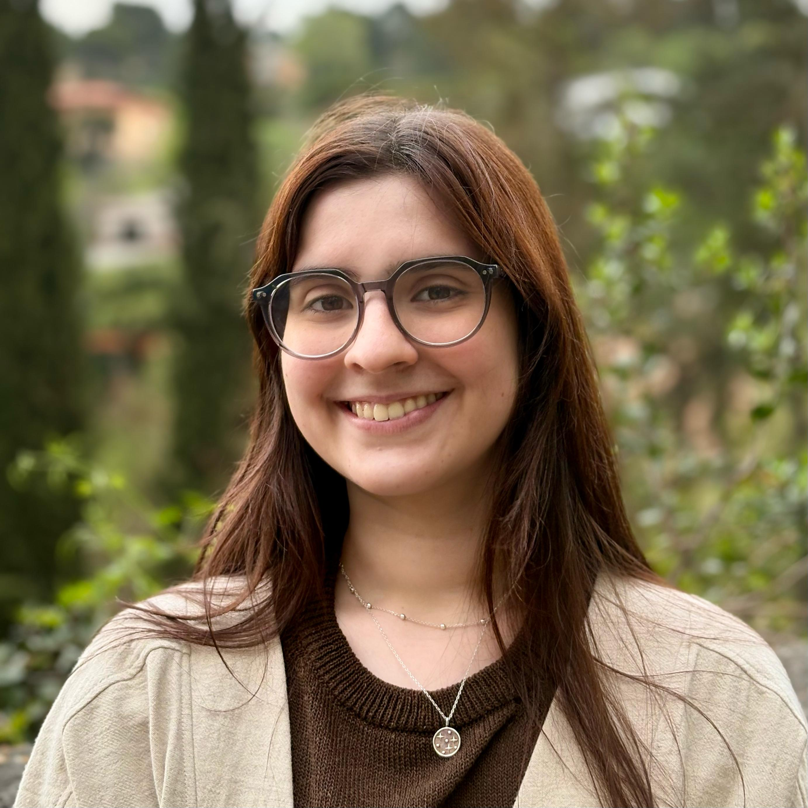

### About Me

I'm Juana, a physics graduate with a focus on theoretical physics and mathematical physics. I also have experience in experimental research, specifically in the study of the magnetic and electric properties of nanoparticles. This site includes my CV and I’ll be adding my past and current projects soon.

As a recent physics graduate, I’ve been actively involved in seminars and collaborative discussions, where I explored advanced concepts and contributed to conversations on current challenges in physics. I’ve also developed skills in data analysis, computational tools, and experimental techniques.

I’m currently looking into master’s programs in theoretical physics, seeking opportunities to build on my academic background and work in research-focused environments.

Thank you for your visit! Enjoy exploring the various dimensions of my professional and personal interests!
