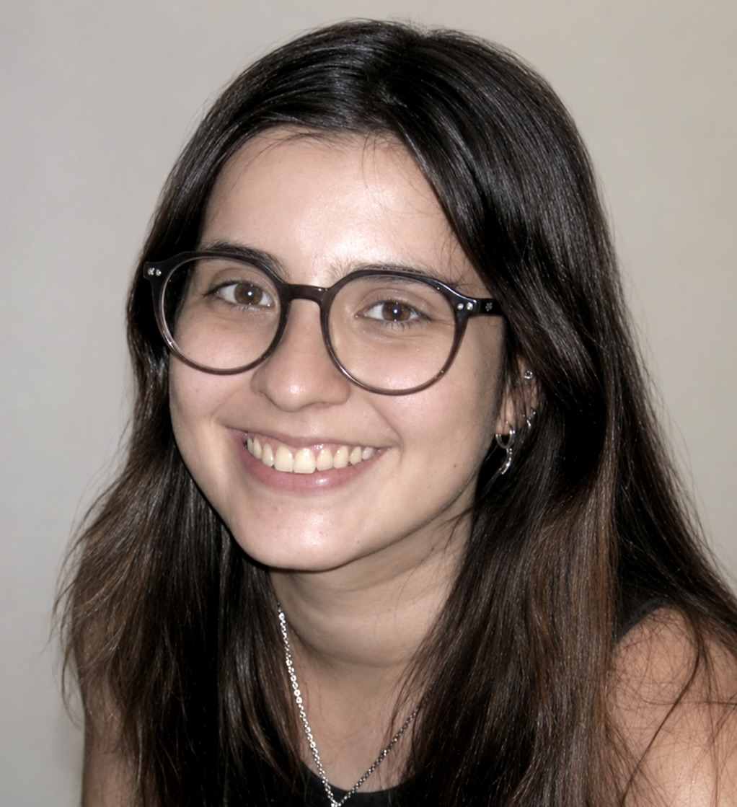

### About Me

I'm Juana, a theoretical physicist with an MSc in Astrophysics, Particle Physics and Cosmology (Universitat de Barcelona) and a BSc in Physics (Universidad de los Andes). My research spans quantum field theory, mathematical physics, renormalization-group methods, statistical field theory, and condensed-matter physics, and I also have hands-on experimental experience studying the magnetic properties of nanoparticles.

I recently completed my master's thesis on symmetry protection and the hierarchy problem, combining lattice/Ising-type models with continuum quantum field theory calculations. I'm now looking for doctoral opportunities in theoretical physics, statistical and non-equilibrium physics, complex systems, and applied mathematics, particularly where field-theoretic and mathematical methods can be applied to collective phenomena.

You can find my [CV](resume.pdf) and get in [touch](contact) via the links above. Below is a selection of my research projects.

---

### Projects

**[Symmetry Protection and the Hierarchy Problem: From Lattice Models to Goofy Transformations](https://github.com/juanagranadosr/ising_odd_RG_flow)** — Master's Thesis, Universitat de Barcelona (2026)

Investigated symmetry protection and the hierarchy problem through complementary lattice and continuum approaches: extended an inverse-Ising renormalization-group pipeline to track Z2-odd operators under Kadanoff blocking, and carried out one-loop QFT calculations of fermion and scalar self-energies to study radiative mass corrections. Graded Matrícula d'Honor (9.8/10). [Read the thesis](https://github.com/juanagranadosr/ising_odd_RG_flow/blob/main/manuscript/TFM_JUANA_GRANADOS.pdf).

**[The wavefront set and its applications in quantum field theory](https://repositorio.uniandes.edu.co/entities/publication/64dde678-9b74-42cc-adc2-50731fda1393)** — Bachelor's Thesis, Universidad de los Andes (2024)

Analyzed wavefront sets and Hörmander's criterion to characterize the singular structure of distributions in quantum field theory, including the Wightman and Feynman propagators and Epstein–Glaser renormalization. Graded Excellent (4.90/5.00).

**[Ising models and Markov chains](https://github.com/juanagranadosr/Ising_probability_project)** — Honors Probability Project, Universidad de los Andes (2023)

Final project for an honors probability course, exploring the Ising model through the lens of Markov chains.
